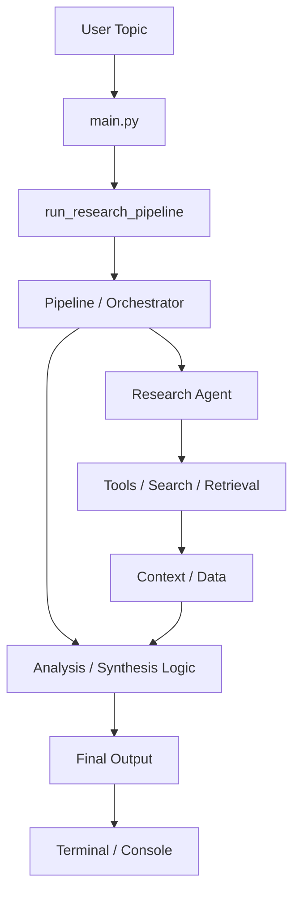

# LangChain Multi-Agent


A lightweight Python project that demonstrates a multi-agent research workflow using LangChain. It starts from a user topic, runs a research pipeline, and produces a structured output in the terminal.

## Overview

This project is a small, practical example of how to orchestrate multiple agents and tools for a research-oriented task. The current entry point is `main.py`, which calls `run_research_pipeline()` with a sample topic.

## Key Features

- Multi-agent orchestration for research tasks
- Simple, beginner-friendly Python entry point
- Pipeline-based execution model
- Extensible architecture for additional tools and agents
- Easy to run locally for experimentation and learning

## Architecture



## Project Structure

```text
langchain-multi-agent/
├── main.py
├── README.md
├── requirements.txt
├── src/
│   ├── agents/
│   ├── pipelines/
│   ├── tools/
│   └── ...
├── tests/
│   └── ...
└── .env.example
```

- `main.py` — application entry point
- `src/pipelines/` — orchestration logic
- `src/agents/` — agent implementations
- `src/tools/` — reusable tool integrations
- `tests/` — automated tests
- `requirements.txt` — Python dependencies

## Setup

Requirements:
- Python 3.10+
- pip
- A virtual environment is recommended

```bash
git clone <repo-url>
cd langchain-multi-agent
python -m venv .venv
.\.venv\Scripts\activate
pip install -r requirements.txt
```

If the project uses external APIs or model credentials, create a `.env` file:

```env
OPENAI_API_KEY=your_key_here
```

## Running the Project

From the repository root:

```bash
python main.py
```

The default example topic currently used is:

```text
How to change career from software engineering to data science
```

## Testing

```bash
pytest
```

## Common Issues and Troubleshooting

- `ModuleNotFoundError`
  - Run: `pip install -r requirements.txt`
- Missing environment variables
  - Check your `.env` file or shell environment
- Import/version issues
  - Use a supported Python version and reinstall dependencies
- Empty or incomplete output
  - Confirm model/provider credentials and access are working

## Example Commands

```bash
# Activate virtual environment on Windows
.\.venv\Scripts\activate

# Install dependencies
pip install -r requirements.txt

# Run the app
python main.py

# Run tests
pytest
```

## Contributing

Contributions are welcome. A typical workflow:

1. Fork the repository
2. Create a feature branch
3. Make your changes
4. Add or update tests if relevant
5. Open a pull request with a clear description

## Support

Open a GitHub issue for bugs or feature requests, or contact the repository maintainer directly.

## License

This repository does not currently include a license file. Before public release or distribution, add an appropriate license such as MIT or Apache 2.0.